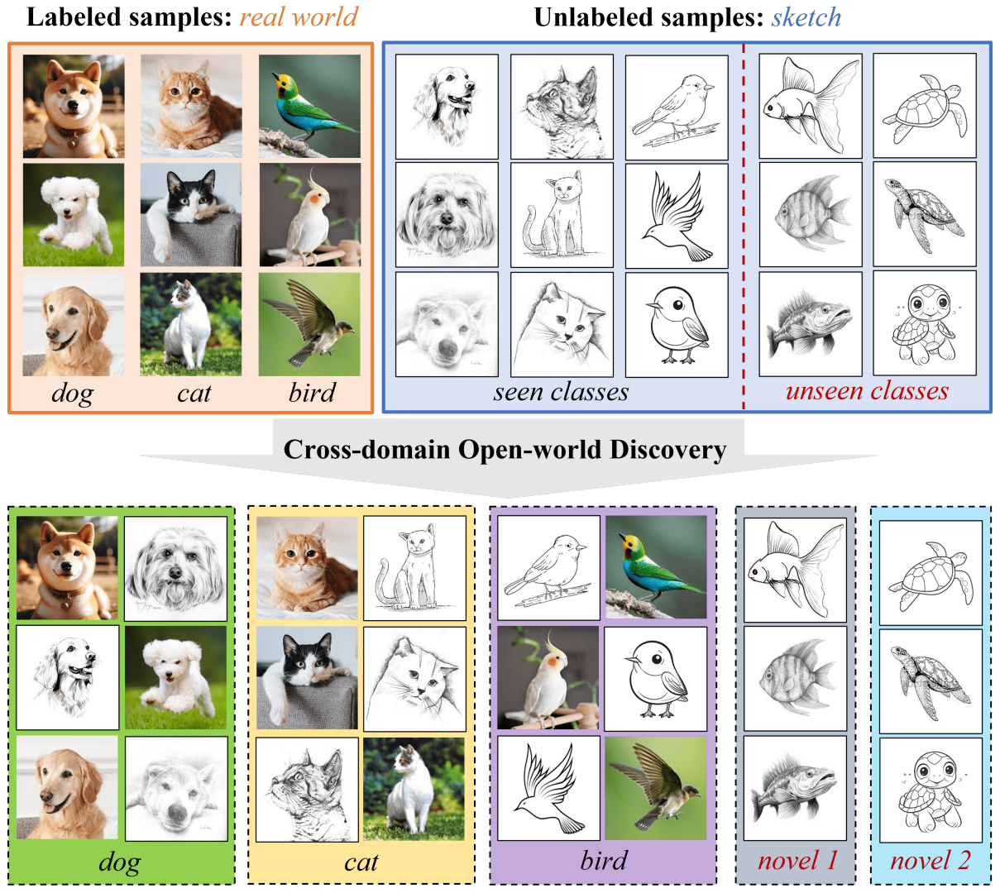

## Cross-domain Open-world Discovery

[Shuo Wen](http://wenshuo128.github.io), [Maria Brbić](https://brbiclab.epfl.ch/team/)

[`Project page`](https://brbiclab.epfl.ch/projects/crow/) | [`Paper`](https://openreview.net/pdf?id=WofwaWjIf7) | [`BibTeX`](#citing) 
_________________
This repo contains the reference source code of the CROW algorithm in PyTorch. CROW is a transductive learning algorithm for the cross-domain open-world discovery setting, where the goal is to recognize previously seen classes and discover novel classes simultaneously under the domain shift between labeled and unlabeled samples. CROW achieves state-of-the-art performance on the four universal domain adaptation benchmark datasets. For more details, please check our paper [Cross-domain Open-world Discovery](https://openreview.net/pdf?id=WofwaWjIf7) (ICML '24).

</br>
<div align="center" style="padding: 0 100pt">

</div>
</br>

### Dependencies
The code is built with the following libraries

- [PyTorch](https://pytorch.org/)
- [torchvision](https://pytorch.org/vision/stable/index.html)
- [numpy](http://numpy.org)
- [scipy](http://scipy.org)
- [scikit-learn](http://scikit-learn.org)
- [clip](https://github.com/openai/CLIP)
- [scanpy](https://scanpy.readthedocs.io/en/stable/index.html)
- [anndata](https://anndata.readthedocs.io/en/latest/tutorials/notebooks/getting-started.html)

### Data Preparation

Before running the code, let's prepare the data. We use standard benchmark domain adaptation datasets:

- [Office-31](https://github.com/jindongwang/transferlearning/blob/master/data/dataset.md#office-31)
- [OfficeHome](https://www.hemanthdv.org/officeHomeDataset.html)
- [VisDA](https://github.com/jindongwang/transferlearning/blob/master/data/dataset.md#VisDA)
- [DomainNet](https://ai.bu.edu/M3SDA/)

We provide the txt file for loading the data in the folder 'Dataset'. Please put the data into the same folder 'Dataset'. For example, put the data of OfficeHome domain Art into path './Dataset/OfficeHome/Art'.

### Get Started

In our paper, we consider 75 different experiment settings. Here, we use OfficeHome, 50% seen/unseen splitting, as an example.

1. Get the CLIP pretrained model
First, let's download the checkpoint of the CLIP pretrained model from [here](https://github.com/openai/CLIP/tree/main). In our experiment, we use ViT-L-14-336px. Please put it in the path './ckpt/clip/ViT-L-14-336px.pt'

After getting the CLIP pretrained model, we begin to run CROW. Steps 2 and 3 are used to get the prototypes by applying k-means to the target samples and supervised learning to the source samples in the CLIP feature space. We provide the **precomputed prototypes** of both source and target samples. If you use our prototypes, please put them in the path './ckpt/prototype_source' and './ckpt/prototype_target'. Then, you can skip steps 2 and 3.

Please download the prototypes [here](https://brbiclab.epfl.ch/wp-content/uploads/2024/06/CROW_prototypes.zip).

*Update:* By using the provided prototypes, you should be able to get the results in the paper. If you run step 2 and 3, you can get better results compared to the results in the paper since we have further optimized some steps. In short, do not be surprised if you get better results compared to the performance in our paper :)

2. Precompute and save the representation features
```
python get_features.py --dataset OfficeHome
```
The _dataset_ should be one of the following: Office, OfficeHome, VisDA, or DomainNet. The precomputed features will be saved in the folder './representations'.

3. Clustering step: find the prototypes for the source and target samples using the precomputed representation features
```
python get_prototype_source.py --dataset OfficeHome
python get_prototype_target.py --dataset OfficeHome
```

4. Matching and Finetuning step:
```
python matching.py --dataset OfficeHome --seen_class 0.5
```
_Seen_class_ is the ratio of seen classes to the total classes. For example, the OfficeHome dataset has 65 total classes, and 0.5 means we consider the setting of 33 seen classes and 32 unseen classes.

### Acknowledgements

While developing CROW we greatly benefited from the open-source repositories:

- [CLIP](https://github.com/openai/CLIP/tree/main)
- [ORCA](https://github.com/snap-stanford/orca/tree/main)

### Citing

If you find our code useful, please consider citing:

```
@inproceedings{shuo2024crow,
title={Cross-domain Open-world Discovery},
author={Wen, Shuo and Brbi’c, Maria},
booktitle={International Conference on Machine Learning},
year={2024},
}
```

